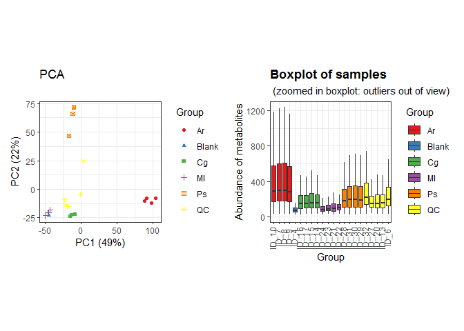
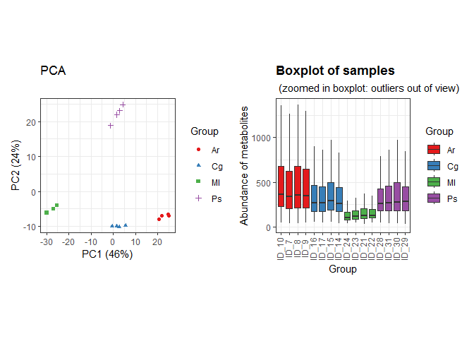
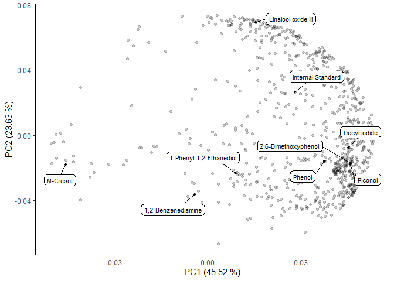
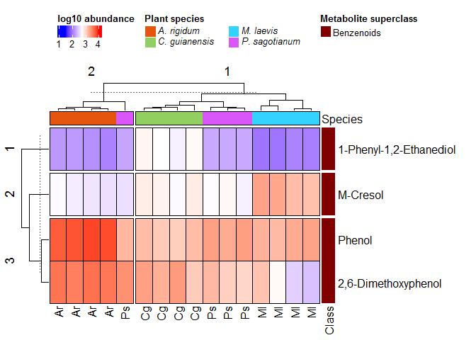

Untargeted characterization of Amazonian barks extracts plants by Liquid
and Gas Chromatography - Mass Spectrometry \| Gas Chromatography - Mass
Spectrometry (GC-MS) data analysis
================
Jefferson Pastuña
2023-08-08

- <a href="#introduction" id="toc-introduction">Introduction</a>
- <a href="#before-to-start" id="toc-before-to-start">Before to start</a>
- <a href="#notame-workflow" id="toc-notame-workflow">Notame workflow</a>
- <a href="#preprocessing" id="toc-preprocessing">Preprocessing</a>
- <a href="#pca-plots" id="toc-pca-plots">PCA plots</a>
- <a href="#heat-map-plot" id="toc-heat-map-plot">Heat map plot</a>

## Introduction

This R Script aims to record the procedure given for metabolic profiling
of 4 species of plant used in Amazonia folk medicine. Each step has a
brief explanation, code and graphics.

The workflow used was taken from [“notame”: Workflow for Non-Targeted
LC–MS Metabolic Profiling](https://doi.org/10.3390/metabo10040135).
Which offers a wide variety of functions to perform metabolomic profile
analysis.

## Before to start

The “notame” package accepts as input a feature table that can be
obtained through software such as MZMine, MSDial, among others. In this
case, the feature table was obtained with the help of MZmine. The
(\*.txt) file was fixed to obtain the final feature table input.

## Notame workflow

As a first step for the analysis,“notame” package and other dependency
packages were installed.

``` r
# Notame package installation
#if (!requireNamespace("devtools", quietly = TRUE)) {
#  install.packages("devtools")
#}
#devtools::install_github("antonvsdata/notame")

# Dependency packages installation
#install_dependencies
```

Then, a main path and a log system was added to have a record of each
process executed.

``` r
# Notame library call
library(notame)
```

    ## Loading required package: Biobase

    ## Loading required package: BiocGenerics

    ## 
    ## Attaching package: 'BiocGenerics'

    ## The following objects are masked from 'package:stats':
    ## 
    ##     IQR, mad, sd, var, xtabs

    ## The following objects are masked from 'package:base':
    ## 
    ##     anyDuplicated, aperm, append, as.data.frame, basename, cbind,
    ##     colnames, dirname, do.call, duplicated, eval, evalq, Filter, Find,
    ##     get, grep, grepl, intersect, is.unsorted, lapply, Map, mapply,
    ##     match, mget, order, paste, pmax, pmax.int, pmin, pmin.int,
    ##     Position, rank, rbind, Reduce, rownames, sapply, setdiff, sort,
    ##     table, tapply, union, unique, unsplit, which.max, which.min

    ## Welcome to Bioconductor
    ## 
    ##     Vignettes contain introductory material; view with
    ##     'browseVignettes()'. To cite Bioconductor, see
    ##     'citation("Biobase")', and for packages 'citation("pkgname")'.

    ## Loading required package: futile.logger

    ## Loading required package: ggplot2

    ## Loading required package: magrittr

``` r
# Main path
ppath <- "F:/Jefferson-Pastuna/Arajuno_Stem_Bark/"
# Log system
init_log(log_file = paste0(ppath, "Result/GCMS/GCMS_log.txt"))
```

    ## INFO [2023-08-31 12:06:14] Starting logging

Next, the MZmine suitable feature list was imported.

``` r
data <- read_from_excel(file = "Data/GCMS_to_R.xlsx", sheet = 3, 
                        corner_row = 6, corner_column = "G", 
                        split_by = c("Column", "Ion Mode"))
```

    ## INFO [2023-08-31 12:06:15] Corner detected correctly at row 6, column G
    ## INFO [2023-08-31 12:06:15] 
    ## Extracting sample information from rows 1 to 6 and columns H to AC
    ## INFO [2023-08-31 12:06:15] Replacing spaces in sample information column names with underscores (_)
    ## INFO [2023-08-31 12:06:15] Naming the last column of sample information "Datafile"
    ## INFO [2023-08-31 12:06:15] 
    ## Extracting feature information from rows 7 to 5456 and columns A to G
    ## INFO [2023-08-31 12:06:15] Creating Split column from Column, Ion Mode
    ## INFO [2023-08-31 12:06:15] Feature_ID column not found, creating feature IDs
    ## INFO [2023-08-31 12:06:15] Identified m/z column mass and retention time column RT
    ## INFO [2023-08-31 12:06:15] Creating feature IDs from Split, m/z and retention time
    ## INFO [2023-08-31 12:06:15] Replacing dots (.) in feature information column names with underscores (_)
    ## INFO [2023-08-31 12:06:15] 
    ## Extracting feature abundances from rows 7 to 5456 and columns H to AC
    ## INFO [2023-08-31 12:06:15] 
    ## Checking sample information
    ## INFO [2023-08-31 12:06:15] QC column generated from rows containing 'QC'
    ## INFO [2023-08-31 12:06:15] Sample ID autogenerated from injection orders and prefix ID_
    ## INFO [2023-08-31 12:06:15] Checking that feature abundances only contain numeric values
    ## INFO [2023-08-31 12:06:15] 
    ## Checking feature information
    ## INFO [2023-08-31 12:06:15] Checking that feature IDs are unique and not stored as numbers
    ## INFO [2023-08-31 12:06:15] Checking that m/z and retention time values are reasonable

Once the data is read, the next step was to create a MetaboSet in order
to obtain a specific R object.

``` r
modes <- construct_metabosets(exprs = data$exprs, 
                              pheno_data = data$pheno_data, 
                              feature_data = data$feature_data,
                              group_col = "Group")
```

    ## Initializing the object(s) with unflagged features
    ## INFO [2023-08-31 12:06:15] 
    ## Checking feature information
    ## INFO [2023-08-31 12:06:15] Checking that feature IDs are unique and not stored as numbers
    ## INFO [2023-08-31 12:06:15] Checking that feature abundances only contain numeric values
    ## INFO [2023-08-31 12:06:15] Setting row and column names of exprs based on feature and pheno data

We can visualize the raw data in order to inspect the processing
routines.

``` r
# Data extraction
mode_test <- modes$Rxt5_EI
# Boxplot of raw data
raw_bp <- plot_sample_boxplots(mode_test,
                               order_by = "Group",
                               fill_by = "Group")
# PCA of raw data
raw_pca <- plot_pca(mode_test,
                       center = TRUE,
                       shape = "Group",
                       color = "Group")
# Package to plots visualization in a same windows
#if (!requireNamespace("devtools", quietly = TRUE)) {
#  install.packages("devtools")
#}
#devtools::install_github("thomasp85/patchwork")
library(patchwork)
# Plot
raw_pca + raw_bp
```

<!-- -->

## Preprocessing

The first step of the preprocessing is to change the features with value
equal to 0 to NA.

``` r
# Data extraction
mode <- modes$Rxt5_EI
# Change 0 value to NA
mode <- mark_nas(mode, value = 0)
```

Then, features with low detection rate are first flagged and then could
be removed. The notame package employs two criteria to select this
features. First, is the feature presence in a percentage of QC
injections, and then the feature presence in a percentage within a
sample group or class.

``` r
# Low detection rate
mode <- flag_detection(mode, qc_limit = 0.80, group_limit = 0.75)
```

    ## INFO [2023-08-31 12:06:19] 
    ## 7% of features flagged for low detection rate

``` r
# Some statistics after low detection algorithm
visualizations(mode, prefix = paste0(ppath, "Figure/GCMS/", "Low_Detection"))
```

With these values, features which that were not detected in the 80% of
the QC injections and 75% of sample groups will be flagged as low
detection rate.

The next step for preprocessing correspond to drift correction. The
drift correction can be applied by smoothed cubic spline regression.

``` r
# Drift correction
corrected <- correct_drift(mode)
```

    ## INFO [2023-08-31 12:11:13] 
    ## Starting drift correction at 2023-08-31 12:11:13
    ## INFO [2023-08-31 12:11:35] Drift correction performed at 2023-08-31 12:11:35
    ## INFO [2023-08-31 12:11:41] Inspecting drift correction results 2023-08-31 12:11:41
    ## INFO [2023-08-31 12:11:58] Drift correction results inspected at 2023-08-31 12:11:58
    ## INFO [2023-08-31 12:11:58] 
    ## Drift correction results inspected, report:
    ## Drift_corrected: 93%,  Missing_QCS: 7%

``` r
corrected <- correct_drift(corrected)   # Second correction to improve drift correction
```

    ## INFO [2023-08-31 12:11:58] 
    ## Starting drift correction at 2023-08-31 12:11:58
    ## INFO [2023-08-31 12:12:19] Drift correction performed at 2023-08-31 12:12:19
    ## INFO [2023-08-31 12:12:19] Inspecting drift correction results 2023-08-31 12:12:19
    ## INFO [2023-08-31 12:12:35] Drift correction results inspected at 2023-08-31 12:12:35
    ## INFO [2023-08-31 12:12:35] 
    ## Drift correction results inspected, report:
    ## Drift_corrected: 93%,  Missing_QCS: 7%

``` r
corrected <- correct_drift(corrected)   # Third correction to improve drift correction
```

    ## INFO [2023-08-31 12:12:35] 
    ## Starting drift correction at 2023-08-31 12:12:35
    ## INFO [2023-08-31 12:12:57] Drift correction performed at 2023-08-31 12:12:57
    ## INFO [2023-08-31 12:12:57] Inspecting drift correction results 2023-08-31 12:12:57
    ## INFO [2023-08-31 12:13:13] Drift correction results inspected at 2023-08-31 12:13:13
    ## INFO [2023-08-31 12:13:13] 
    ## Drift correction results inspected, report:
    ## Drift_corrected: 93%,  Missing_QCS: 7%

``` r
# Flag low quality features
corrected <- flag_quality(corrected, condition = "RSD_r < 0.3 & D_ratio_r < 0.6")
```

    ## INFO [2023-08-31 12:13:13] 
    ## 20% of features flagged for low quality

Then we can visualize the data after drift correction.

``` r
# Boxplot
corr_bp <- plot_sample_boxplots(corrected,
                                      order_by = "Group",
                                      fill_by = "Group")
# PCA
corr_pca <- plot_pca(corrected,
                        center = TRUE,
                        shape = "Group",
                        color = "Group") 
# Plot
corr_pca + corr_bp
```

<!-- -->

Contaminant peaks based on the Process Blank will be removed.

``` r
# Removal of contaminants
corrected_no_blank <- flag_contaminants(corrected,
                                        blank_col = "Group",
                                        blank_label = "Blank",
                                        flag_thresh = 0.30,
                                        flag_label = "Contaminant")
```

    ## INFO [2023-08-31 12:13:16] 
    ## 47% of features flagged as contaminants

``` r
# Removal blank group from dataset
corrected_no_blank <- corrected_no_blank[, corrected_no_blank$Group != "Blank"]
```

``` r
# Some statistics after low detection algorithm
visualizations(corrected_no_blank, prefix = paste0(ppath, "Figure/GCMS/", "No_Blank"))
```

The next step removes the QC from the analysis, since they will not be
needed in subsequent treatments.

``` r
corrected_no_qc <- drop_qcs(corrected_no_blank)
```

We can visualize data without QC.

``` r
# Boxplot
no_qc_bp <- plot_sample_boxplots(corrected_no_qc,
                                 order_by = "Group",
                                 fill_by = "Group")
# PCA
no_qc_pca <- plot_pca(corrected_no_qc,
                      center = TRUE,
                      shape = "Group",
                      color = "Group")
# Plot
no_qc_pca + no_qc_bp
```

<!-- -->

The next step is feature clustering. This step helps us reduce the
number of features of the same molecule that were split due to 70 eV EI
ionization behavior.

``` r
clustered <- cluster_features(corrected_no_qc,
                              rt_window = 1/600,
                              all_features = TRUE,
                              corr_thresh = 0.95,
                              d_thresh = 0.8,
                              plotting = TRUE,
                              prefix = paste0(ppath, "Cluster/GCMS/GCMS_Cluster"))
compressed <- compress_clusters(clustered)
```

We can inspect PCA plot after clustering algorithm.

``` r
# Boxplot
compr_bp <- plot_sample_boxplots(compressed,
                                 order_by = "Group",
                                 fill_by = "Group")
# PCA
compr_pca <- plot_pca(compressed,
                      center = TRUE,
                      shape = "Group",
                      color = "Group")
# Plot
compr_pca + compr_bp
```

<!-- -->

The next step imputes the data.

``` r
# To clean data
set.seed(21)
imputed <- impute_rf(compressed)
```

    ## INFO [2023-08-31 12:39:24] 
    ## Starting random forest imputation at 2023-08-31 12:39:24
    ## INFO [2023-08-31 12:39:29] Out-of-bag error in random forest imputation: 0.114
    ## INFO [2023-08-31 12:39:29] Random forest imputation finished at 2023-08-31 12:39:29

``` r
# To all data
imputed <- impute_rf(imputed, all_features = TRUE)
```

    ## INFO [2023-08-31 12:39:29] 
    ## Starting random forest imputation at 2023-08-31 12:39:29
    ## INFO [2023-08-31 12:40:00] Out-of-bag error in random forest imputation: 0.4
    ## INFO [2023-08-31 12:40:00] Random forest imputation finished at 2023-08-31 12:40:00

We can inspect PCA plot after imputation.

``` r
# Boxplot
imp_bp <- plot_sample_boxplots(imputed,
                               order_by = "Group",
                               fill_by = "Group")
# PCA
imp_pca <- plot_pca(imputed,
                    center = TRUE,
                    shape = "Group",
                    color = "Group")
# Plot
imp_pca + imp_bp
```

<!-- -->

Finally the data is ready to be exported and proceed with the
statistical analysis.

``` r
save(imputed, file = paste0(ppath, "Result/GCMS/Notame_GCMS_output.RData"))
```

# PCA plots

Droping flagged features

``` r
# Extract clean data
no_flag <- drop_flagged(imputed)
# Extracting feature height table
peak_height <- exprs(no_flag)
# Extracting Phenotipic data
pheno_data <- no_flag@phenoData@data
```

Preparing data and transposing feature table.

``` r
# Transposing feature height table
transp_table  <- t(peak_height)
# Changing NA to 0 
transp_table[is.na(transp_table)]=0
# Centering and Scaling features
ei_pca <- prcomp(transp_table, center = TRUE, scale. = TRUE)
```

Plotting PCA results.

``` r
# Library to left_join use
library(dplyr)
# PCA scores
scores <- ei_pca$x %>%                   # Get PC coordinates
  data.frame %>%                         # Convert to data frames
  mutate(Sample_ID = rownames(.)) %>%    # Create a new column with the sample names
  left_join(pheno_data )                 # Adding metadata
# PCA plot
ggplot(scores,
       aes(PC1, PC2, shape = Species, color = Species)) +
  geom_point(size = 3) +
  guides(x=guide_axis(title = "PC1 (45.52 %)"),
         y=guide_axis(title = "PC2 (23.63 %)")) +
  theme_classic()
```

<!-- -->

``` r
# Save plot
ggsave('Result/GCMS/GCMS_PCA.png', width = 5, height = 4, device='png', dpi="print")
```

Plotting loading results.

``` r
loadings <- ei_pca$rotation %>%           # Extract loadings
  data.frame(Feature_ID = rownames(.))  # New column with feat name
```

Creating an artificial table with Feature name and Compound column.

``` r
# Load a metabolite name table
metab_name <- readxl::read_excel("Data/GCMS_Metabolites.xlsx", 5)
# Creating a new small table of the annotated compounds
ei_compouds <- left_join(metab_name, loadings)
# Plotting results
ggplot(loadings, aes(PC1, PC2)) + 
  geom_point(alpha = 0.2) +
  theme_classic() + 
  geom_point(data = ei_compouds, size = 1) +
  ggrepel::geom_label_repel(data = ei_compouds,
                            aes(label = Metabolite_name),
                            box.padding = 0.8,
                            label.padding = 0.3,
                            label.r = 0.3,
                            cex = 3) +
  guides(x=guide_axis(title = "PC1 (45.52 %)"),
         y=guide_axis(title = "PC2 (23.63 %)")) +
  ggsci::scale_color_aaas()
```

<!-- -->

``` r
# Save plot
ggsave('Result/GCMS/GCMS_Loadings.png', width = 5, height = 4, device='png', dpi="print")
```

# Heat map plot

ComplexHeatmap package and dependency installation.

``` r
# ComplexHeatmap package installation
#if (!requireNamespace("BiocManager", quietly=TRUE))
#    install.packages("BiocManager")
#BiocManager::install("ComplexHeatmap")
library(ComplexHeatmap)

# ColorRamp2 package installation
#if (!requireNamespace("devtools", quietly = TRUE)) {
#  install.packages("devtools")
#}
#devtools::install_github("jokergoo/colorRamp2")
library(colorRamp2)

# Cowplot package installation
#install.packages("cowplot")
library(cowplot)
```

Extracting and loaded of identified metabolites abundance.

``` r
# Metabolite name table without internal standard
metab_name_hm <- readxl::read_excel("Data/GCMS_Metabolites.xlsx", 6)
# Add identified metabolite to "notame" output
add_met <- join_fData(no_flag, metab_name_hm)
# Extracting identified metabolite data
raw_hm <- add_met[!is.na(add_met@featureData@data$Metabolite_name),]
# Extracting feature height table
hm_height <- exprs(raw_hm)
# Extracting sample information
hm_pdata <- raw_hm@phenoData@data
# Extracting feature information
hm_fdata <- raw_hm@featureData@data
```

Scaling, row and top heatmap anotation.

``` r
set.seed(1540)
# Logarithmic scale
hm_scl <- log10(hm_height)
rownames(hm_scl) <- hm_fdata$Metabolite_name
colnames(hm_scl) <- hm_pdata$Group
# Metabolite class color
cols_metclass <- c("Benzenoids" = "#800000FF",
                   "Organoheterocyclic compounds" = "#8A9045FF",
                   "Organohalogen compounds" = "#FFA319FF",
                   "Internal Standard" = "#767676FF")
# Add row anotation to HeatMap
hm_row_ann <- rowAnnotation(`Class` = hm_fdata$Superclass,
                            col = list(`Class` = cols_metclass),
                            show_annotation_name = T,
                            show_legend=F)
# Species color
cols_species <- c("A. rigidum" = "#e6550d",
                 "C. guianensis" = "#91cf60",
                 "M. laevis" = "#33d2ff",
                 "P. sagotianum" = "#d957f8")
# Add top anotation to HeatMap
top_info_ann <- HeatmapAnnotation(`Species` = hm_pdata$Species,
                                  col = list(`Species` = cols_species),
                                  show_annotation_name = T,
                                  show_legend=F, 
                                  border = TRUE)
# Color scale
mycol <- colorRamp2(c(1.5, 2.75, 4),
                    c("blue", "white", "red"))
# Heatmap matrix plotting
hm_plot <- Heatmap(hm_scl,
        col = mycol,
        border_gp = grid::gpar(col = "black", lty = 0.05),
        rect_gp = grid::gpar(col = "black", lwd = 0.75),
        clustering_distance_columns = "euclidean",
        clustering_method_columns = "complete",
        top_annotation = top_info_ann,
        right_annotation = hm_row_ann,
        show_heatmap_legend = F,
        row_km = 3, column_km = 2)
hm_plot
```

<!-- -->

Adding legends to heatmap.

``` r
# Color scale legend
lgd1 <- Legend(col_fun = mycol,
               title = "log10 abundance",
               at = seq(4),
               direction = "horizontal" )
# Plants species legend
lgd2 <- Legend(labels = gt_render(c("*A. rigidum*",
                                    "*C. guianensis*",
                                    "*M. laevis*",
                                    "*P. sagotianum*")),
               legend_gp = gpar(fill = cols_species),
               title = "Plants species", ncol = 1)
# Metabolite class Legend
lgd3 <- Legend(labels = c(unique(hm_fdata$Superclass)) ,
               legend_gp = gpar(fill = cols_metclass), 
               title = "Metabolite Class", ncol = 1)
```

ComplexHeatmap plot

``` r
set.seed(1540)
# Converting to ggplot
gg_heatmap <- grid.grabExpr(draw(hm_plot))
gg_heatmap <- ggpubr::as_ggplot(gg_heatmap)
# Legends
all_legends <- packLegend(lgd1, lgd2, lgd3, direction = "horizontal")
gg_legend <- grid.grabExpr(draw(all_legends))
gg_legend_fn <- ggpubr::as_ggplot(gg_legend)
# Heatmap plot
gcms_hm <- plot_grid(gg_legend_fn,
          gg_heatmap, ncol = 1,
          rel_heights = c(0.195, 0.88))
gcms_hm
```

<!-- -->

``` r
# Save heatmap plot
ggsave(filename = "Result/GCMS/GCMS_Heatmap.jpeg", plot = gcms_hm,
      width = 5, height = 3, units = "in", dpi = 300, scale = 1.7)
```

Finish a record.

``` r
finish_log()
```

    ## INFO [2023-08-31 12:40:09] Finished analysis. Thu Aug 31 12:40:09 2023
    ## Session info:
    ## 
    ## INFO [2023-08-31 12:40:09] R version 4.2.2 (2022-10-31 ucrt)
    ## INFO [2023-08-31 12:40:09] Platform: x86_64-w64-mingw32/x64 (64-bit)
    ## INFO [2023-08-31 12:40:09] Running under: Windows 7 x64 (build 7601) Service Pack 1
    ## INFO [2023-08-31 12:40:09] 
    ## INFO [2023-08-31 12:40:09] Matrix products: default
    ## INFO [2023-08-31 12:40:09] 
    ## INFO [2023-08-31 12:40:09] locale:
    ## INFO [2023-08-31 12:40:09] [1] LC_COLLATE=English_United States.1252 
    ## INFO [2023-08-31 12:40:09] [2] LC_CTYPE=English_United States.1252   
    ## INFO [2023-08-31 12:40:09] [3] LC_MONETARY=English_United States.1252
    ## INFO [2023-08-31 12:40:09] [4] LC_NUMERIC=C                          
    ## INFO [2023-08-31 12:40:09] [5] LC_TIME=English_United States.1252    
    ## INFO [2023-08-31 12:40:09] 
    ## INFO [2023-08-31 12:40:09] attached base packages:
    ## INFO [2023-08-31 12:40:09] [1] grid      stats     graphics  grDevices utils     datasets  methods  
    ## INFO [2023-08-31 12:40:09] [8] base     
    ## INFO [2023-08-31 12:40:09] 
    ## INFO [2023-08-31 12:40:09] other attached packages:
    ## INFO [2023-08-31 12:40:09]  [1] cowplot_1.1.2         colorRamp2_0.0.1      ComplexHeatmap_2.14.0
    ## INFO [2023-08-31 12:40:09]  [4] dplyr_1.1.0           patchwork_1.1.2.9000  notame_0.2.0         
    ## INFO [2023-08-31 12:40:09]  [7] magrittr_2.0.3        ggplot2_3.4.1.9000    futile.logger_1.4.3  
    ## INFO [2023-08-31 12:40:09] [10] Biobase_2.58.0        BiocGenerics_0.44.0  
    ## INFO [2023-08-31 12:40:09] 
    ## INFO [2023-08-31 12:40:09] loaded via a namespace (and not attached):
    ## INFO [2023-08-31 12:40:09]  [1] matrixStats_0.63.0   fs_1.6.1             usethis_2.1.6       
    ## INFO [2023-08-31 12:40:09]  [4] doParallel_1.0.14    RColorBrewer_1.1-3   ggsci_3.0.0         
    ## INFO [2023-08-31 12:40:09]  [7] backports_1.4.1      tools_4.2.2          doRNG_1.8.6         
    ## INFO [2023-08-31 12:40:09] [10] utf8_1.2.3           R6_2.5.1             colorspace_2.1-0    
    ## INFO [2023-08-31 12:40:09] [13] GetoptLong_1.0.5     withr_2.5.0          tidyselect_1.2.0    
    ## INFO [2023-08-31 12:40:09] [16] compiler_4.2.2       textshaping_0.3.6    cli_3.6.0           
    ## INFO [2023-08-31 12:40:09] [19] formatR_1.14         xml2_1.3.3           ggdendro_0.1.23     
    ## INFO [2023-08-31 12:40:09] [22] labeling_0.4.2       scales_1.2.1         randomForest_4.7-1.1
    ## INFO [2023-08-31 12:40:09] [25] askpass_1.1          stringr_1.5.0        commonmark_1.8.1    
    ## INFO [2023-08-31 12:40:09] [28] systemfonts_1.0.4    digest_0.6.31        rmarkdown_2.20      
    ## INFO [2023-08-31 12:40:09] [31] pkgconfig_2.0.3      htmltools_0.5.4      fastmap_1.1.0       
    ## INFO [2023-08-31 12:40:09] [34] itertools_0.1-3      highr_0.10           rlang_1.0.6         
    ## INFO [2023-08-31 12:40:09] [37] GlobalOptions_0.1.2  readxl_1.4.2         rstudioapi_0.14     
    ## INFO [2023-08-31 12:40:09] [40] shape_1.4.6          farver_2.1.1         generics_0.1.3      
    ## INFO [2023-08-31 12:40:09] [43] car_3.1-2            zip_2.2.2            credentials_1.3.2   
    ## INFO [2023-08-31 12:40:09] [46] Rcpp_1.0.10          munsell_0.5.0        S4Vectors_0.36.2    
    ## INFO [2023-08-31 12:40:09] [49] fansi_1.0.4          abind_1.4-5          lifecycle_1.0.3     
    ## INFO [2023-08-31 12:40:09] [52] stringi_1.7.12       yaml_2.3.7           carData_3.0-5       
    ## INFO [2023-08-31 12:40:09] [55] MASS_7.3-58.1        Rtsne_0.17           parallel_4.2.2      
    ## INFO [2023-08-31 12:40:09] [58] ggrepel_0.9.2.9999   crayon_1.5.2         gridtext_0.1.5      
    ## INFO [2023-08-31 12:40:09] [61] circlize_0.4.15      sys_3.4.1            knitr_1.42          
    ## INFO [2023-08-31 12:40:09] [64] pillar_1.8.1         ggpubr_0.6.0         igraph_1.4.1.9003   
    ## INFO [2023-08-31 12:40:09] [67] rjson_0.2.21         ggsignif_0.6.4       markdown_1.5        
    ## INFO [2023-08-31 12:40:09] [70] rngtools_1.5.2       codetools_0.2-18     stats4_4.2.2        
    ## INFO [2023-08-31 12:40:09] [73] futile.options_1.0.1 glue_1.6.2           evaluate_0.20       
    ## INFO [2023-08-31 12:40:09] [76] pcaMethods_1.90.0    lambda.r_1.2.4       png_0.1-8           
    ## INFO [2023-08-31 12:40:09] [79] vctrs_0.5.2          missForest_1.5       foreach_1.5.2       
    ## INFO [2023-08-31 12:40:09] [82] cellranger_1.1.0     gtable_0.3.1         openssl_2.0.5       
    ## INFO [2023-08-31 12:40:09] [85] purrr_1.0.1          tidyr_1.3.0          clue_0.3-64         
    ## INFO [2023-08-31 12:40:09] [88] xfun_0.37            openxlsx_4.2.5.2     broom_1.0.3         
    ## INFO [2023-08-31 12:40:09] [91] rstatix_0.7.2        ragg_1.2.5           viridisLite_0.4.1   
    ## INFO [2023-08-31 12:40:09] [94] gert_1.9.2           tibble_3.1.8         iterators_1.0.14    
    ## INFO [2023-08-31 12:40:09] [97] IRanges_2.32.0       cluster_2.1.4
