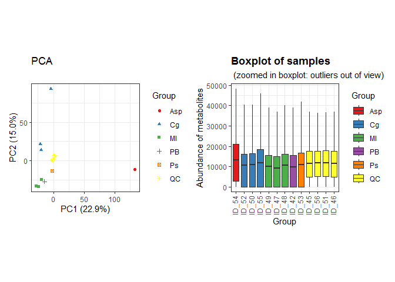
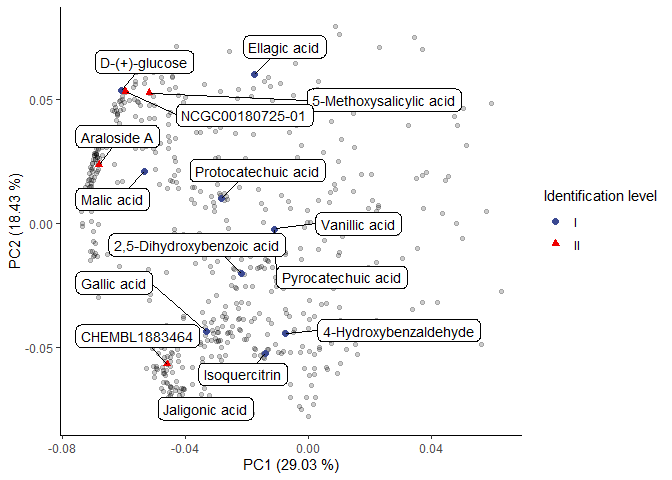
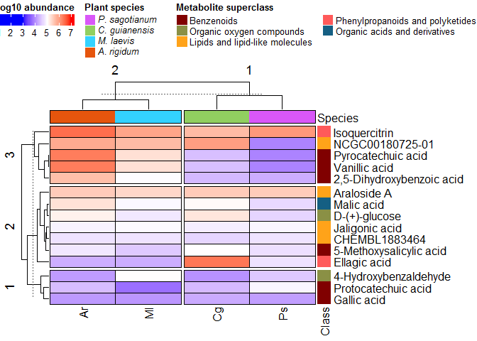

Untargeted characterization of Amazonian barks extracts plants by Liquid
and Gas Chromatography - Mass Spectrometry \| Liquid Chromatography -
Mass Spectrometry (LC-MS) data analysis 1
================
Jefferson Pastuña
2023-08-31

- <a href="#introduction" id="toc-introduction">Introduction</a>
- <a href="#before-to-start" id="toc-before-to-start">Before to start</a>
- <a href="#notame-workflow" id="toc-notame-workflow">Notame workflow</a>
- <a href="#preprocessing" id="toc-preprocessing">Preprocessing</a>
- <a href="#pca-plots" id="toc-pca-plots">PCA plots</a>
- <a href="#heat-map-plot" id="toc-heat-map-plot">Heat map plot</a>

## Introduction

This R Script aims to record the procedure given for metabolic profiling
of 4 species of plant used in Amazonia folk medicine. Each step has a
brief explanation, code and graphics.

The workflow used was taken from [“notame”: Workflow for Non-Targeted
LC–MS Metabolic Profiling](https://doi.org/10.3390/metabo10040135).
Which offers a wide variety of functions to perform metabolomic profile
analysis.

## Before to start

The “notame” package accepts as input a feature table that can be
obtained through software such as MZmine, MS-DIAL, among others. In this
case, the feature table was obtained with the help of MZmine. The
(\*.csv) file was fixed to obtain the final feature table input.

## Notame workflow

As a first step for the analysis,“notame” package and other dependency
packages were installed.

``` r
# Notame package installation
#if (!requireNamespace("devtools", quietly = TRUE)) {
#  install.packages("devtools")
#}
#devtools::install_github("antonvsdata/notame")
# Notame library call
library(notame)
# Dependency packages installation
install_dependencies
```

    ## function (preprocessing = TRUE, extra = FALSE, batch_corr = FALSE, 
    ##     misc = FALSE, ...) 
    ## {
    ##     core_cran <- c("BiocManager", "cowplot", "missForest", "openxlsx", 
    ##         "randomForest", "RColorBrewer", "Rtsne")
    ##     core_bioconductor <- "pcaMethods"
    ##     extra_cran <- c("car", "doParallel", "devEMF", "ggbeeswarm", 
    ##         "ggdendro", "ggrepel", "Hmisc", "hexbin", "igraph", "lme4", 
    ##         "lmerTest", "MuMIn", "PERMANOVA", "PK", "rmcorr")
    ##     extra_bioconductor <- c("mixOmics", "supraHex")
    ##     extra_gitlab <- "CarlBrunius/MUVR"
    ##     batch_cran <- "fpc"
    ##     batch_bioconductor <- "RUVSeq"
    ##     batch_github <- NULL
    ##     batch_gitlab <- "CarlBrunius/batchCorr"
    ##     misc_cran <- c("knitr", "rmarkdown", "testthat")
    ##     if (preprocessing) {
    ##         install_helper(cran = core_cran, bioconductor = core_bioconductor, 
    ##             ...)
    ##     }
    ##     if (extra) {
    ##         install_helper(cran = extra_cran, bioconductor = extra_bioconductor, 
    ##             gitlab = extra_gitlab, ...)
    ##     }
    ##     if (batch_corr) {
    ##         install_helper(cran = batch_cran, bioconductor = batch_bioconductor, 
    ##             github = batch_github, gitlab = batch_gitlab, ...)
    ##     }
    ##     if (misc) {
    ##         install_helper(cran = misc_cran, ...)
    ##     }
    ## }
    ## <bytecode: 0x000000000ff88c60>
    ## <environment: namespace:notame>

Then, a main path and a log system was added to have a record of each
process executed.

``` r
# Main path
ppath <- "F:/Jefferson-Pastuna/Arajuno_Stem_Bark/"
# Log system
init_log(log_file = paste0(ppath, "Result/LCMS/LCMS_log.txt"))
```

    ## INFO [2023-12-07 20:10:40] Starting logging

Next, the MZmine suitable feature list was imported.

``` r
data <- read_from_excel(file = "Data/LCMS_to_R.xlsx", sheet = 5, 
                        corner_row = 5, corner_column = "J", 
                        split_by = c("Column", "Ion Mode"))
```

    ## INFO [2023-12-07 20:10:41] Corner detected correctly at row 5, column J
    ## INFO [2023-12-07 20:10:41] 
    ## Extracting sample information from rows 1 to 5 and columns K to W
    ## INFO [2023-12-07 20:10:41] Replacing spaces in sample information column names with underscores (_)
    ## INFO [2023-12-07 20:10:41] Naming the last column of sample information "Datafile"
    ## INFO [2023-12-07 20:10:41] 
    ## Extracting feature information from rows 6 to 7367 and columns A to J
    ## INFO [2023-12-07 20:10:41] Creating Split column from Column, Ion Mode
    ## INFO [2023-12-07 20:10:41] Feature_ID column not found, creating feature IDs
    ## INFO [2023-12-07 20:10:41] Identified m/z column mass and retention time column RT
    ## INFO [2023-12-07 20:10:41] Creating feature IDs from Split, m/z and retention time
    ## INFO [2023-12-07 20:10:41] Replacing dots (.) in feature information column names with underscores (_)
    ## INFO [2023-12-07 20:10:41] 
    ## Extracting feature abundances from rows 6 to 7367 and columns K to W
    ## INFO [2023-12-07 20:10:41] 
    ## Checking sample information
    ## INFO [2023-12-07 20:10:41] QC column generated from rows containing 'QC'
    ## INFO [2023-12-07 20:10:41] Sample ID autogenerated from injection orders and prefix ID_
    ## INFO [2023-12-07 20:10:41] Checking that feature abundances only contain numeric values
    ## INFO [2023-12-07 20:10:41] 
    ## Checking feature information
    ## INFO [2023-12-07 20:10:41] Checking that feature IDs are unique and not stored as numbers
    ## INFO [2023-12-07 20:10:41] Checking that m/z and retention time values are reasonable

Once the data is read, the next step was to create a MetaboSet in order
to obtain a specific R object.

``` r
modes <- construct_metabosets(exprs = data$exprs, 
                              pheno_data = data$pheno_data, 
                              feature_data = data$feature_data,
                              group_col = "Group")
```

    ## Initializing the object(s) with unflagged features
    ## INFO [2023-12-07 20:10:41] 
    ## Checking feature information
    ## INFO [2023-12-07 20:10:41] Checking that feature IDs are unique and not stored as numbers
    ## INFO [2023-12-07 20:10:41] Checking that feature abundances only contain numeric values
    ## INFO [2023-12-07 20:10:41] Setting row and column names of exprs based on feature and pheno data

We can visualize the raw data in order to inspect the processing
routines.

``` r
# Data extraction
mode_test <- modes$RP_NEG
# Boxplot of raw data
raw_bp <- plot_sample_boxplots(mode_test,
                               order_by = "Group",
                               fill_by = "Group")
# PCA of raw data
raw_pca <- plot_pca(mode_test,
                       center = TRUE,
                       shape = "Group",
                       color = "Group")
# Package to plots visualization in a same windows
#if (!requireNamespace("devtools", quietly = TRUE)) {
#  install.packages("devtools")
#}
#devtools::install_github("thomasp85/patchwork")
library(patchwork)
# Plot
raw_pca + raw_bp
```

<!-- -->

## Preprocessing

The first step of the preprocessing is to change the features with value
equal to 0 to NA.

``` r
# Data extraction
mode <- modes$RP_NEG
# Change 0 value to NA
mode <- mark_nas(mode, value = 0)
```

Then, features with low detection rate are first flagged and then could
be removed. The “notame” package employs two criteria to select this
features. First, is the feature presence in a percentage of QC
injections, and then the feature presence in a percentage within a
sample group or class.

``` r
# Low detection rate
mode <- flag_detection(mode, qc_limit = 3/4, group_limit = 0)
```

    ## INFO [2023-12-07 20:10:45] 
    ## 15% of features flagged for low detection rate

``` r
# Some statistics after low detection algorithm
visualizations(mode, prefix = paste0(ppath, "Figure/LCMS/", "Low_Detection"))
```

With these values, features which that were not detected in 75% of the
QC injections will be flagged as low detection rate.

The next step for preprocessing correspond to drift correction. The
drift correction can be applied by smoothed cubic spline regression.

``` r
# Drift correction
corrected <- correct_drift(mode)
```

    ## INFO [2023-12-07 20:16:41] 
    ## Starting drift correction at 2023-12-07 20:16:41
    ## INFO [2023-12-07 20:17:03] Drift correction performed at 2023-12-07 20:17:03
    ## INFO [2023-12-07 20:17:12] Inspecting drift correction results 2023-12-07 20:17:12
    ## INFO [2023-12-07 20:17:32] Drift correction results inspected at 2023-12-07 20:17:32
    ## INFO [2023-12-07 20:17:32] 
    ## Drift correction results inspected, report:
    ## Drift_corrected: 72%,  Missing_QCS: 28%

``` r
# Flag low quality features
corrected <- flag_quality(corrected)
```

    ## INFO [2023-12-07 20:17:32] 
    ## 35% of features flagged for low quality

Then we can visualize the data after drift correction.

``` r
# Boxplot
corr_bp <- plot_sample_boxplots(corrected,
                                      order_by = "Group",
                                      fill_by = "Group")
# PCA
corr_pca <- plot_pca(corrected,
                        center = TRUE,
                        shape = "Group",
                        color = "Group") 
# Plot
corr_pca + corr_bp
```

<!-- -->

Contaminant peaks based on the process blank will be removed.

``` r
# Removal of contaminants
corrected_no_blank <- flag_contaminants(corrected,
                                        blank_col = "Group",
                                        blank_label = "PB",
                                        flag_thresh = 0.8,
                                        flag_label = "Contaminant")
```

    ## INFO [2023-12-07 20:17:34] 
    ## 28% of features flagged as contaminants

``` r
# Removal blank group from dataset
corrected_no_blank <- corrected_no_blank[, corrected_no_blank$Group != "PB"]
```

``` r
# Some statistics after feature blank detection algorithm
visualizations(corrected_no_blank, prefix = paste0(ppath, "Figure/LCMS/", "No_Blank"))
```

The next step is feature clustering. This step helps us reduce the
number of features of the same molecule that were split due to
ionization behavior (In-source fragmentation for example).

``` r
clustered <- cluster_features(corrected_no_blank,
                              rt_window = 1/60,
                              all_features = TRUE,
                              corr_thresh = 0.90,
                              d_thresh = 0.8,
                              plotting = TRUE,
                              prefix = paste0(ppath, "Cluster/LCMS/LCMS_Cluster")
                              )
compressed <- compress_clusters(clustered)
```

We can inspect data after clustering algorithm.

``` r
# Boxplot
compr_bp <- plot_sample_boxplots(compressed,
                                 order_by = "Group",
                                 fill_by = "Group")
# PCA
compr_pca <- plot_pca(compressed,
                        center = TRUE,
                        shape = "Group",
                        color = "Group") 
# Plot
compr_pca + compr_pca
```

<!-- -->

The next step imputes the data.

``` r
# To clean data
set.seed(123)
imputed <- impute_rf(compressed)
```

    ## INFO [2023-12-07 21:07:19] 
    ## Starting random forest imputation at 2023-12-07 21:07:19
    ## INFO [2023-12-07 21:07:28] Out-of-bag error in random forest imputation: 0.449
    ## INFO [2023-12-07 21:07:28] Random forest imputation finished at 2023-12-07 21:07:28

We can inspect PCA plot after imputation.

``` r
# Boxplot
imp_bp <- plot_sample_boxplots(imputed,
                               order_by = "Group",
                               fill_by = "Group")
# PCA
imp_pca <- plot_pca(imputed,
                    center = TRUE,
                    shape = "Group",
                    color = "Group")
# Plot
imp_pca + imp_bp
```

<!-- -->

Finally, the data is ready to be exported and proceed with the
statistical analysis.

``` r
save(imputed, file = paste0(ppath, "Result/LCMS/Notame_LCMS_output.RData"))
```

# PCA plots

Droping flagged features

``` r
# Extract clean data
no_flag <- drop_flagged(imputed)

# Extracting feature height table
peak_height <- exprs(no_flag)
# Extracting samples information
pheno_data <- no_flag@phenoData@data
# Extracting feature information
feat_data <- no_flag@featureData@data
```

Preparing data and transposing feature table.

``` r
# Transposing feature height table
transp_table  <- t(peak_height)
# Changing NA to 0 
transp_table[is.na(transp_table)]=0
# Centering and Scaling features
neg_pca <- prcomp(transp_table, center = TRUE, scale. = TRUE)
```

Plotting PCA results.

``` r
# Library to left_join use
library(dplyr)
# PCA scores
scores <- neg_pca$x %>%                  # Get PC coordinates
  data.frame %>%                         # Convert to data frames
  mutate(Sample_ID = rownames(.)) %>%    # Create a new column with the sample names
  left_join(pheno_data )                 # Adding metadata
# PCA plot
ggplot(scores,
       aes(PC1, PC2, shape = Species, color = Species)) +
  geom_point(size = 3) +
  guides(x=guide_axis(title = "PC1 (29.03 %)"),
         y=guide_axis(title = "PC2 (18.43 %)")) +
  theme_classic()
```

<!-- -->

``` r
# Save plot
ggsave("Result/LCMS/LCMS_PCA.png", width = 5, height = 4, device='png', dpi="print")
```

Plotting loading results.

``` r
loadings <- neg_pca$rotation %>%           # Extract loadings
  data.frame(Cluster_ID = rownames(.))     # New column with feature name
```

Creating an artificial table with feature ID and compound name column.

``` r
# Exporting notame output to find and filter identified metabolites
write_to_excel(clustered, "Result/LCMS/Clustered_features.xlsx")
# Load a metabolite name table
metab_name <- readxl::read_excel("Data/LCMS_Metabolites.xlsx", 1)
# Creating a new small table of the annotated compounds
neg_compouds <- left_join(metab_name, loadings)
# Plotting results
ggplot(loadings, aes(PC1, PC2)) + 
  geom_point(alpha = 0.2) +
  theme_classic() + 
  geom_point(data = neg_compouds,
             aes(shape = `Identification level`, color = `Identification level`),
             size = 2) +
  ggrepel::geom_label_repel(data = neg_compouds,
                            aes(label = Metabolite_name),
                            box.padding = 0.8,
                            label.padding = 0.3,
                            label.r = 0.3,
                            cex = 3) +
  guides(x=guide_axis(title = "PC1 (29.03 %)"),
         y=guide_axis(title = "PC2 (18.43 %)")) +
  ggsci::scale_color_aaas()
```

<!-- -->

``` r
# Save plot
ggsave('Result/LCMS/LCMS_Loadings.png', width = 10, height = 6, device='png', dpi="print")
```

# Heat map plot

ComplexHeatmap package and dependency installation.

``` r
# ComplexHeatmap package installation
#if (!requireNamespace("BiocManager", quietly=TRUE))
#    install.packages("BiocManager")
#BiocManager::install("ComplexHeatmap")
library(ComplexHeatmap)

# ColorRamp2 package installation
#if (!requireNamespace("devtools", quietly = TRUE)) {
#  install.packages("devtools")
#}
#devtools::install_github("jokergoo/colorRamp2")
library(colorRamp2)

# Cowplot package installation
#install.packages("cowplot")
library(cowplot)
```

Extracting and loaded of identified metabolites abundance.

``` r
# Exporting "notame" output to find and filter height of identified metabolites
write_to_excel(no_flag, "Result/LCMS/no_flag_features.xlsx")
```

    ## INFO [2023-12-07 21:07:36] Moved Datafile column to last to get meaningful column names for abundances

``` r
# Metabolite name table
metab_name_hm <- readxl::read_excel("Data/LCMS_Metabolite_HeatMap.xlsx", 2)
# Logarithmic scale
hm_scl <- metab_name_hm[, 6:9] %>% as.matrix %>% log10()
rownames(hm_scl) <- metab_name_hm$Metabolite_name
# Metabolite classification
metab_class <- metab_name_hm %>% select(Superclass, Metabolite = Metabolite_name)
# Metabolite class to HeatMap anotation
met_class_annotation <-  metab_class %>% select(Superclass) %>% 
  as.matrix()
rownames(met_class_annotation) <- metab_class$Metabolite
# Top information
top_info <- data.frame(Species = c( rep("A. rigidum"),
                                    rep("C. guianensis"),
                                    rep("M. laevis"),
                                    rep("P. sagotianum"))) 
rownames(top_info) <- paste(top_info$Species, rep(c(1, 2, 3, 4)))
top_info <- as.matrix(top_info)
```

Scaling, row and top heatmap anotation.

``` r
set.seed(2024)
# Metabolite class color
cols_metclass <- c("Benzenoids" = "#800000FF",
                   "Organic oxygen compounds" = "#8A9045FF",
                   "Lipids and lipid-like molecules" = "#FFA319FF",
                   "Phenylpropanoids and polyketides" = "#FF5A5A",
                   "Organic acids and derivatives" = "#155F83FF")
# Add row anotation to HeatMap
hm_row_ann <- rowAnnotation(Metabolite = met_class_annotation,
                            col = list(Metabolite = cols_metclass),
                            show_annotation_name = T,
                            show_legend=F)
# Species color
cols_species <- c("A. rigidum" = "#e6550d",
                 "C. guianensis" = "#91cf60",
                 "M. laevis" = "#33d2ff",
                 "P. sagotianum" = "#d957f8")
# Add top anotation to HeatMap
top_info_ann <- HeatmapAnnotation(`Species` = top_info,
                                  col = list(`Species` = cols_species),
                                  show_annotation_name = T,
                                  show_legend=F, 
                                  border = TRUE)
# Color scale
mycol <- colorRamp2(c(3, 5, 7),
                    c("blue", "white", "red"))
# Heatmap matrix plotting
hm_plot <- Heatmap(hm_scl,
        col = mycol,
        border_gp = grid::gpar(col = "black", lty = 0.05),
        rect_gp = grid::gpar(col = "black", lwd = 0.75),
        clustering_distance_columns = "euclidean",
        clustering_method_columns = "complete",
        top_annotation = top_info_ann,
        right_annotation = hm_row_ann,
        show_heatmap_legend = F,
        row_km = 3, column_km = 2)
hm_plot
```

<!-- -->

Adding legends to heatmap.

``` r
# Color scale legend
lgd1 <- Legend(col_fun = mycol,
               title = "log10 abundance",
               at = seq(7),
               direction = "horizontal" )
# Plants species legend
lgd2 <- Legend(labels = gt_render(c("*A. rigidum*",
                                    "*C. guianensis*",
                                    "*M. laevis*",
                                    "*P. sagotianum*")),
               legend_gp = gpar(fill = cols_species),
               title = "Plant species", ncol = 1)
# Metabolite class Legend
lgd3 <- Legend(labels = c(unique(metab_class$Superclass)),
               legend_gp = gpar(fill = cols_metclass), 
               title = "Metabolite superclass", ncol = 2)
```

ComplexHeatmap plot

``` r
set.seed(2024)
# Converting to ggplot
gg_heatmap <- grid.grabExpr(draw(hm_plot))
gg_heatmap <- ggpubr::as_ggplot(gg_heatmap)
# Legends
all_legends <- packLegend(lgd1, lgd2, lgd3, direction = "horizontal")
gg_legend <- grid.grabExpr(draw(all_legends))
gg_legend_fn <- ggpubr::as_ggplot(gg_legend)
# Heatmap plot
gcms_hm <- plot_grid(gg_legend_fn,
          gg_heatmap, ncol = 1,
          rel_heights = c(0.857, 4))
gcms_hm
```

<!-- -->

``` r
# Save heatmap plot
ggsave(filename = "Result/LCMS/LCMS_Heatmap.jpeg", plot = gcms_hm,
      width = 5, height = 4, units = "in", dpi = 300, scale = 1.7)
```

Finish a record.

``` r
finish_log()
```

    ## INFO [2023-12-07 21:07:41] Finished analysis. Thu Dec  7 21:07:41 2023
    ## Session info:
    ## 
    ## INFO [2023-12-07 21:07:41] R version 4.2.2 (2022-10-31 ucrt)
    ## INFO [2023-12-07 21:07:41] Platform: x86_64-w64-mingw32/x64 (64-bit)
    ## INFO [2023-12-07 21:07:41] Running under: Windows 7 x64 (build 7601) Service Pack 1
    ## INFO [2023-12-07 21:07:41] 
    ## INFO [2023-12-07 21:07:41] Matrix products: default
    ## INFO [2023-12-07 21:07:41] 
    ## INFO [2023-12-07 21:07:41] locale:
    ## INFO [2023-12-07 21:07:41] [1] LC_COLLATE=English_United States.1252 
    ## INFO [2023-12-07 21:07:41] [2] LC_CTYPE=English_United States.1252   
    ## INFO [2023-12-07 21:07:41] [3] LC_MONETARY=English_United States.1252
    ## INFO [2023-12-07 21:07:41] [4] LC_NUMERIC=C                          
    ## INFO [2023-12-07 21:07:41] [5] LC_TIME=English_United States.1252    
    ## INFO [2023-12-07 21:07:41] 
    ## INFO [2023-12-07 21:07:41] attached base packages:
    ## INFO [2023-12-07 21:07:41] [1] grid      stats     graphics  grDevices utils     datasets  methods  
    ## INFO [2023-12-07 21:07:41] [8] base     
    ## INFO [2023-12-07 21:07:41] 
    ## INFO [2023-12-07 21:07:41] other attached packages:
    ## INFO [2023-12-07 21:07:41]  [1] cowplot_1.1.2         colorRamp2_0.0.1      ComplexHeatmap_2.14.0
    ## INFO [2023-12-07 21:07:41]  [4] dplyr_1.1.0           patchwork_1.1.2.9000  notame_0.2.0         
    ## INFO [2023-12-07 21:07:41]  [7] magrittr_2.0.3        ggplot2_3.4.1.9000    futile.logger_1.4.3  
    ## INFO [2023-12-07 21:07:41] [10] Biobase_2.58.0        BiocGenerics_0.44.0  
    ## INFO [2023-12-07 21:07:41] 
    ## INFO [2023-12-07 21:07:41] loaded via a namespace (and not attached):
    ## INFO [2023-12-07 21:07:41]  [1] matrixStats_0.63.0   fs_1.6.1             usethis_2.1.6       
    ## INFO [2023-12-07 21:07:41]  [4] doParallel_1.0.14    RColorBrewer_1.1-3   ggsci_3.0.0         
    ## INFO [2023-12-07 21:07:41]  [7] backports_1.4.1      tools_4.2.2          doRNG_1.8.6         
    ## INFO [2023-12-07 21:07:41] [10] utf8_1.2.3           R6_2.5.1             colorspace_2.1-0    
    ## INFO [2023-12-07 21:07:41] [13] GetoptLong_1.0.5     withr_2.5.0          tidyselect_1.2.0    
    ## INFO [2023-12-07 21:07:41] [16] compiler_4.2.2       textshaping_0.3.6    cli_3.6.0           
    ## INFO [2023-12-07 21:07:41] [19] formatR_1.14         xml2_1.3.3           ggdendro_0.1.23     
    ## INFO [2023-12-07 21:07:41] [22] labeling_0.4.2       scales_1.2.1         randomForest_4.7-1.1
    ## INFO [2023-12-07 21:07:41] [25] askpass_1.1          stringr_1.5.0        commonmark_1.8.1    
    ## INFO [2023-12-07 21:07:41] [28] systemfonts_1.0.4    digest_0.6.31        rmarkdown_2.20      
    ## INFO [2023-12-07 21:07:41] [31] pkgconfig_2.0.3      htmltools_0.5.4      fastmap_1.1.0       
    ## INFO [2023-12-07 21:07:41] [34] itertools_0.1-3      highr_0.10           rlang_1.0.6         
    ## INFO [2023-12-07 21:07:41] [37] GlobalOptions_0.1.2  readxl_1.4.2         rstudioapi_0.14     
    ## INFO [2023-12-07 21:07:41] [40] shape_1.4.6          farver_2.1.1         generics_0.1.3      
    ## INFO [2023-12-07 21:07:41] [43] car_3.1-2            zip_2.2.2            credentials_1.3.2   
    ## INFO [2023-12-07 21:07:41] [46] Rcpp_1.0.10          munsell_0.5.0        S4Vectors_0.36.2    
    ## INFO [2023-12-07 21:07:41] [49] fansi_1.0.4          abind_1.4-5          lifecycle_1.0.3     
    ## INFO [2023-12-07 21:07:41] [52] stringi_1.7.12       yaml_2.3.7           carData_3.0-5       
    ## INFO [2023-12-07 21:07:41] [55] MASS_7.3-58.1        Rtsne_0.17           parallel_4.2.2      
    ## INFO [2023-12-07 21:07:41] [58] ggrepel_0.9.2.9999   crayon_1.5.2         gridtext_0.1.5      
    ## INFO [2023-12-07 21:07:41] [61] circlize_0.4.15      sys_3.4.1            knitr_1.42          
    ## INFO [2023-12-07 21:07:41] [64] pillar_1.8.1         ggpubr_0.6.0         igraph_1.4.1.9003   
    ## INFO [2023-12-07 21:07:41] [67] rjson_0.2.21         ggsignif_0.6.4       markdown_1.5        
    ## INFO [2023-12-07 21:07:41] [70] rngtools_1.5.2       codetools_0.2-18     stats4_4.2.2        
    ## INFO [2023-12-07 21:07:41] [73] futile.options_1.0.1 glue_1.6.2           evaluate_0.20       
    ## INFO [2023-12-07 21:07:41] [76] pcaMethods_1.90.0    lambda.r_1.2.4       png_0.1-8           
    ## INFO [2023-12-07 21:07:41] [79] vctrs_0.5.2          missForest_1.5       foreach_1.5.2       
    ## INFO [2023-12-07 21:07:41] [82] cellranger_1.1.0     gtable_0.3.1         openssl_2.0.5       
    ## INFO [2023-12-07 21:07:41] [85] purrr_1.0.1          tidyr_1.3.0          clue_0.3-64         
    ## INFO [2023-12-07 21:07:41] [88] xfun_0.37            openxlsx_4.2.5.2     broom_1.0.3         
    ## INFO [2023-12-07 21:07:41] [91] rstatix_0.7.2        ragg_1.2.5           viridisLite_0.4.1   
    ## INFO [2023-12-07 21:07:41] [94] gert_1.9.2           tibble_3.1.8         iterators_1.0.14    
    ## INFO [2023-12-07 21:07:41] [97] IRanges_2.32.0       cluster_2.1.4
