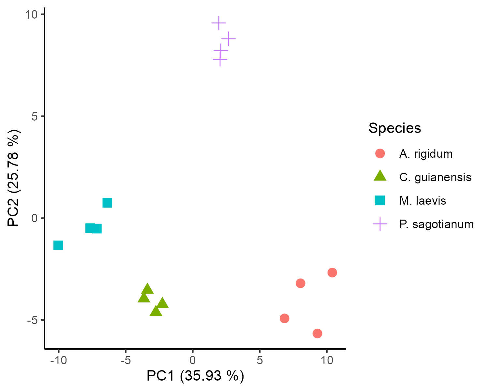

# About this repository

The present document aims to record the procedure given for the
statistical analysis of secondary metabolites present in 4 species 
of plant (*Aspidosperma rigidum*, *Couroupita guianensis*, 
*Monteverdia laevis* and *Protium sagotianum*) used in Amazonia 
medicine recipes. For each step a brief explanation, the code and 
graphics obtained are included.

# Analysis Notebooks

- [LC-MS Neg
  polarity first dataset](https://github.com/IKIAM-NPL/Arajuno_Stem_Bark/blob/main/Firts_LCMS_Dataset.md)
- [LC-MS Neg
  polarity second dataset](https://github.com/IKIAM-NPL/Arajuno_Stem_Bark/blob/main/Second_LCMS_Dataset.md)
- [GC-EI-MS](https://github.com/IKIAM-NPL/Arajuno_Stem_Bark/blob/main/GCMS_Arajuno_Stem_Bark.md)

# Useful results

## PCA analysis

- LC-(QTOF)

- GC-(Q)MS

## Heatmaps and HCA

- LC-(QTOF)

- GC-(Q)MS

