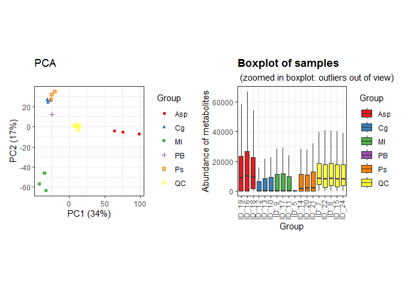
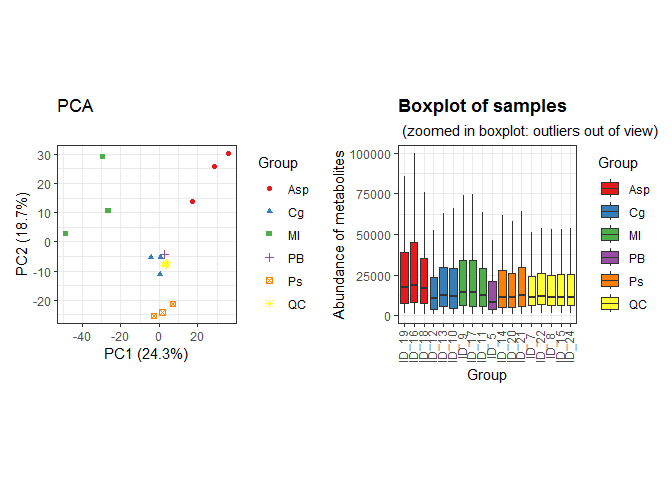
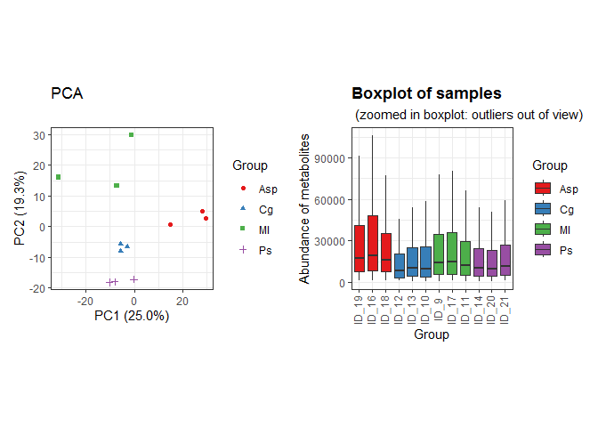
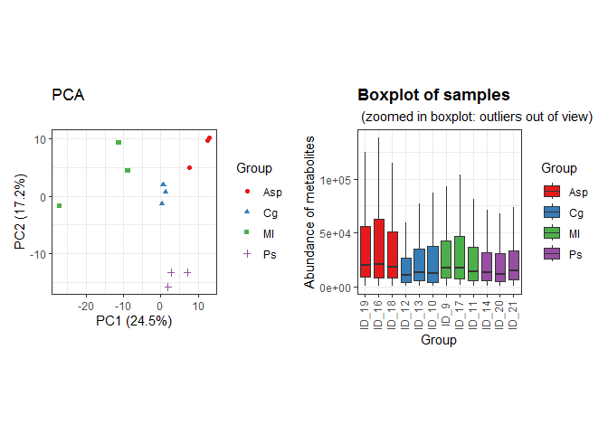
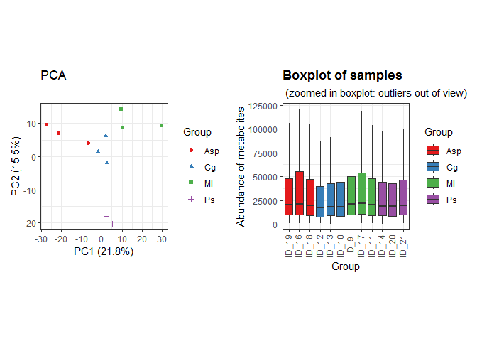
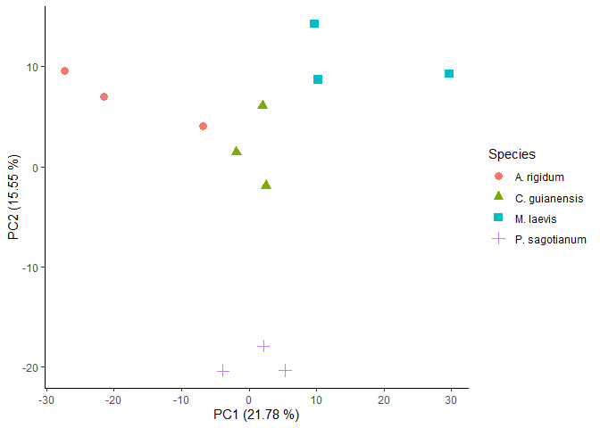
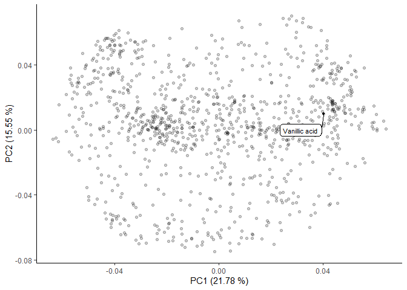

Untargeted characterization of Amazonian barks extracts plants by Liquid
and Gas Chromatography - Mass Spectrometry \| Liquid Chromatography -
Mass Spectrometry (LC-MS) data analysis 2
================
Jefferson Pastuña
2023-10-20

- <a href="#introduction" id="toc-introduction">Introduction</a>
- <a href="#before-to-start" id="toc-before-to-start">Before to start</a>
- <a href="#notame-workflow" id="toc-notame-workflow">Notame workflow</a>
- <a href="#preprocessing" id="toc-preprocessing">Preprocessing</a>
- <a href="#pca-plots" id="toc-pca-plots">PCA plots</a>

## Introduction

This R Script aims to record the procedure given for metabolic profiling
of 4 species of plant used in Amazonia folk medicine. Each step has a
brief explanation, code and graphics.

The workflow used was taken from [“notame”: Workflow for Non-Targeted
LC–MS Metabolic Profiling](https://doi.org/10.3390/metabo10040135).
Which offers a wide variety of functions to perform metabolomic profile
analysis.

## Before to start

The “notame” package accepts as input a feature table that can be
obtained through software such as MZmine, MS-DIAL, among others. In this
case, the feature table was obtained with the help of MZmine. The
(\*.csv) file was fixed to obtain the final feature table input.

## Notame workflow

As a first step for the analysis,“notame” package and other dependency
packages were installed.

``` r
# Notame package installation
#if (!requireNamespace("devtools", quietly = TRUE)) {
#  install.packages("devtools")
#}
#devtools::install_github("antonvsdata/notame")

# Notame library call
library(notame)

# Dependency packages installation
install_dependencies
```

    ## function (preprocessing = TRUE, extra = FALSE, batch_corr = FALSE, 
    ##     misc = FALSE, ...) 
    ## {
    ##     core_cran <- c("BiocManager", "cowplot", "missForest", "openxlsx", 
    ##         "randomForest", "RColorBrewer", "Rtsne")
    ##     core_bioconductor <- "pcaMethods"
    ##     extra_cran <- c("car", "doParallel", "devEMF", "ggbeeswarm", 
    ##         "ggdendro", "ggrepel", "Hmisc", "hexbin", "igraph", "lme4", 
    ##         "lmerTest", "MuMIn", "PERMANOVA", "PK", "rmcorr")
    ##     extra_bioconductor <- c("mixOmics", "supraHex")
    ##     extra_gitlab <- "CarlBrunius/MUVR"
    ##     batch_cran <- "fpc"
    ##     batch_bioconductor <- "RUVSeq"
    ##     batch_github <- NULL
    ##     batch_gitlab <- "CarlBrunius/batchCorr"
    ##     misc_cran <- c("knitr", "rmarkdown", "testthat")
    ##     if (preprocessing) {
    ##         install_helper(cran = core_cran, bioconductor = core_bioconductor, 
    ##             ...)
    ##     }
    ##     if (extra) {
    ##         install_helper(cran = extra_cran, bioconductor = extra_bioconductor, 
    ##             gitlab = extra_gitlab, ...)
    ##     }
    ##     if (batch_corr) {
    ##         install_helper(cran = batch_cran, bioconductor = batch_bioconductor, 
    ##             github = batch_github, gitlab = batch_gitlab, ...)
    ##     }
    ##     if (misc) {
    ##         install_helper(cran = misc_cran, ...)
    ##     }
    ## }
    ## <bytecode: 0x0000000014096df0>
    ## <environment: namespace:notame>

Then, a main path and a log system was added to have a record of each
process executed.

``` r
# Main path
ppath <- "F:/Jefferson-Pastuna/Arajuno_Stem_Bark/"
# Log system
init_log(log_file = paste0(ppath, "Result/LCMS/Second_LCMS_Dataset_log.txt"))
```

    ## INFO [2023-12-19 03:14:05] Starting logging

Next, the MZmine suitable feature list was imported.

``` r
data <- read_from_excel(file = "Data/Second_LCMS_Dataset_to_R.xlsx", sheet = 3, 
                        corner_row = 5, corner_column = "I", 
                        split_by = c("Column", "Ion Mode"))
```

    ## INFO [2023-12-19 03:14:06] Corner detected correctly at row 5, column I
    ## INFO [2023-12-19 03:14:06] 
    ## Extracting sample information from rows 1 to 5 and columns J to AA
    ## INFO [2023-12-19 03:14:06] Replacing spaces in sample information column names with underscores (_)
    ## INFO [2023-12-19 03:14:06] Naming the last column of sample information "Datafile"
    ## INFO [2023-12-19 03:14:06] 
    ## Extracting feature information from rows 6 to 5097 and columns A to I
    ## INFO [2023-12-19 03:14:06] Creating Split column from Column, Ion Mode
    ## INFO [2023-12-19 03:14:06] Feature_ID column not found, creating feature IDs
    ## INFO [2023-12-19 03:14:06] Identified m/z column mass and retention time column RT
    ## INFO [2023-12-19 03:14:06] Creating feature IDs from Split, m/z and retention time
    ## INFO [2023-12-19 03:14:06] Replacing dots (.) in feature information column names with underscores (_)
    ## INFO [2023-12-19 03:14:06] 
    ## Extracting feature abundances from rows 6 to 5097 and columns J to AA
    ## INFO [2023-12-19 03:14:06] 
    ## Checking sample information
    ## INFO [2023-12-19 03:14:06] QC column generated from rows containing 'QC'
    ## INFO [2023-12-19 03:14:06] Sample ID autogenerated from injection orders and prefix ID_
    ## INFO [2023-12-19 03:14:06] Checking that feature abundances only contain numeric values
    ## INFO [2023-12-19 03:14:06] 
    ## Checking feature information
    ## INFO [2023-12-19 03:14:06] Checking that feature IDs are unique and not stored as numbers
    ## INFO [2023-12-19 03:14:06] Checking that m/z and retention time values are reasonable

Once the data is read, the next step was to create a MetaboSet in order
to obtain a specific R object.

``` r
modes <- construct_metabosets(exprs = data$exprs, 
                              pheno_data = data$pheno_data, 
                              feature_data = data$feature_data,
                              group_col = "Group")
```

    ## Initializing the object(s) with unflagged features
    ## INFO [2023-12-19 03:14:06] 
    ## Checking feature information
    ## INFO [2023-12-19 03:14:06] Checking that feature IDs are unique and not stored as numbers
    ## INFO [2023-12-19 03:14:06] Checking that feature abundances only contain numeric values
    ## INFO [2023-12-19 03:14:06] Setting row and column names of exprs based on feature and pheno data

We can visualize the raw data in order to inspect the processing
routines.

``` r
# Data extraction
mode_test <- modes$RP_NEG
# Boxplot of raw data
raw_bp <- plot_sample_boxplots(mode_test,
                               order_by = "Group",
                               fill_by = "Group")
# PCA of raw data
raw_pca <- plot_pca(mode_test,
                       center = TRUE,
                       shape = "Group",
                       color = "Group")
# Package to plots visualization in a same windows
#if (!requireNamespace("devtools", quietly = TRUE)) {
#  install.packages("devtools")
#}
#devtools::install_github("thomasp85/patchwork")
library(patchwork)
# Plot
raw_pca + raw_bp
```

<!-- -->

## Preprocessing

The first step of the preprocessing is to change the features with value
equal to 0 to NA.

``` r
# Data extraction
mode <- modes$RP_NEG
# Change 0 value to NA
mode <- mark_nas(mode, value = 0)
```

Then, features with low detection rate are first flagged and then could
be removed. The “notame” package employs two criteria to select this
features. First, is the feature presence in a percentage of QC
injections, and then the feature presence in a percentage within a
sample group or class.

``` r
# Low detection rate
mode <- flag_detection(mode, qc_limit = 3/4, group_limit = 2/3)
```

    ## INFO [2023-12-19 03:14:10] 
    ## 21% of features flagged for low detection rate

``` r
# Some statistics after low detection algorithm
visualizations(mode, prefix = paste0(ppath, "Figure/LCMS/", "2nd_Low_Det"))
```

With these values, features which that were not detected in the 75% of
the QC injections and 67% of sample groups will be flagged as low
detection rate.

The next step for preprocessing correspond to drift correction. The
drift correction can be applied by smoothed cubic spline regression.

``` r
# Drift correction
corrected <- correct_drift(mode)
```

    ## INFO [2023-12-19 03:18:09] 
    ## Starting drift correction at 2023-12-19 03:18:09
    ## INFO [2023-12-19 03:18:27] Drift correction performed at 2023-12-19 03:18:27
    ## INFO [2023-12-19 03:18:34] Inspecting drift correction results 2023-12-19 03:18:34
    ## INFO [2023-12-19 03:18:49] Drift correction results inspected at 2023-12-19 03:18:49
    ## INFO [2023-12-19 03:18:49] 
    ## Drift correction results inspected, report:
    ## Drift_corrected: 80%,  Missing_QCS: 20%

``` r
# Flag low quality features
corrected <- flag_quality(corrected)
```

    ## INFO [2023-12-19 03:18:49] 
    ## 27% of features flagged for low quality

Then we can visualize the data after drift correction.

``` r
# Boxplot
corr_bp <- plot_sample_boxplots(corrected,
                                      order_by = "Group",
                                      fill_by = "Group")
# PCA
corr_pca <- plot_pca(corrected,
                        center = TRUE,
                        shape = "Group",
                        color = "Group") 
# Plot
corr_pca + corr_bp
```

<!-- -->

Contaminant peaks based on the process blank will be removed.

``` r
# Removal of contaminants
corrected_no_blank <- flag_contaminants(corrected,
                                        blank_col = "Group",
                                        blank_label = "PB",
                                        flag_thresh = 0.80,
                                        flag_label = "Contaminant")
```

    ## INFO [2023-12-19 03:18:51] 
    ## 6% of features flagged as contaminants

``` r
# Removal blank group from dataset
corrected_no_blank <- corrected_no_blank[, corrected_no_blank$Group != "PB"]
```

``` r
# Some statistics after low detection algorithm
visualizations(corrected_no_blank, prefix = paste0(ppath, "Figure/LCMS/", "2nd_No_Blank"))
```

The next step removes the QC from the analysis, since they will not be
needed in subsequent treatments.

``` r
corrected_no_qc <- drop_qcs(corrected_no_blank)
```

We can visualize data without QC.

``` r
# Boxplot
no_qc_bp <- plot_sample_boxplots(corrected_no_qc,
                                 order_by = "Group",
                                 fill_by = "Group")
# PCA
no_qc_pca <- plot_pca(corrected_no_qc,
                      center = TRUE,
                      shape = "Group",
                      color = "Group")
# Plot
no_qc_pca + no_qc_bp
```

<!-- -->

The next step is feature clustering. This step helps us reduce the
number of features of the same molecule that were split due to
ionization behavior (In-source fragmentation for example).

``` r
clustered <- cluster_features(corrected_no_qc,
                              rt_window = 1/60,
                              all_features = TRUE,
                              corr_thresh = 0.90,
                              d_thresh = 0.8
                              #plotting = TRUE,
                              #prefix = paste0(ppath, "Cluster/LCMS/H2OMeOH_Cluster")
                              )
compressed <- compress_clusters(clustered)
```

We can inspect PCA plot after clustering algorithm.

``` r
# Boxplot
compr_bp <- plot_sample_boxplots(compressed,
                                 order_by = "Group",
                                 fill_by = "Group")
# PCA
compr_pca <- plot_pca(compressed,
                      center = TRUE,
                      shape = "Group",
                      color = "Group")
# Plot
compr_pca + compr_bp
```

<!-- -->

The next step imputes the data.

``` r
# To clean data
set.seed(123)
imputed <- impute_rf(compressed)
```

    ## INFO [2023-12-19 03:58:09] 
    ## Starting random forest imputation at 2023-12-19 03:58:09
    ## INFO [2023-12-19 03:58:16] Out-of-bag error in random forest imputation: 0.48
    ## INFO [2023-12-19 03:58:16] Random forest imputation finished at 2023-12-19 03:58:16

We can inspect PCA plot after imputation.

``` r
# Boxplot
imp_bp <- plot_sample_boxplots(imputed,
                               order_by = "Group",
                               fill_by = "Group")
# PCA
imp_pca <- plot_pca(imputed,
                    center = TRUE,
                    shape = "Group",
                    color = "Group")
# Plot
imp_pca + imp_bp
```

<!-- -->

Finally, the data is ready to be exported and proceed with the
statistical analysis.

``` r
save(imputed, file = paste0(ppath, "Result/LCMS/2nd_LCMS_notame_output.RData"))
```

# PCA plots

Droping flagged features

``` r
# Extract clean data
no_flag <- drop_flagged(imputed)
# Extracting feature height table
peak_height <- exprs(no_flag)
# Extracting samples information
pheno_data <- no_flag@phenoData@data
# Extracting feature information
feat_data <- no_flag@featureData@data
```

Preparing data and transposing feature table.

``` r
# Transposing feature height table
transp_table  <- t(peak_height)
# Changing NA to 0 
transp_table[is.na(transp_table)]=0
# Centering and Scaling features
neg_pca <- prcomp(transp_table, center = TRUE, scale. = TRUE)
```

Plotting PCA results.

``` r
# Library to left_join use
library(dplyr)
# PCA scores
scores <- neg_pca$x %>%                   # Get PC coordinates
  data.frame %>%                          # Convert to data frames
  mutate(Sample_ID = rownames(.)) %>%     # Create a new column with the sample names
  left_join(pheno_data )                  # Adding metadata
# PCA plot
ggplot(scores,
       aes(PC1, PC2, shape = Species, color = Species)) +
  geom_point(size = 3) +
  guides(x=guide_axis(title = "PC1 (21.78 %)"),
         y=guide_axis(title = "PC2 (15.55 %)")) +
  theme_classic()
```

<!-- -->

``` r
# Save plot
ggsave("Result/LCMS/2nd_LCMS_PCA.png", width = 5, height = 4, device='png', dpi="print")
```

Plotting loading results.

``` r
loadings <- neg_pca$rotation %>%           # Extract loadings
  data.frame(Cluster_ID = rownames(.))     # New column with feat name
```

Creating an artificial table with feature ID and compound name column.

``` r
# Load a metabolite name table
metab_name <- readxl::read_excel("Data/Second_LCMS_Metabolites.xlsx", 1)
# Creating a new table of identifield metabolites
compouds_tab <- left_join(metab_name, loadings)
# Plotting results
ggplot(loadings, aes(PC1, PC2)) + 
  geom_point(alpha = 0.2) +
  theme_classic() + 
  geom_point(data = compouds_tab, size = 1) +
  ggrepel::geom_label_repel(data = compouds_tab,
                            aes(label = Metabolite_name),
                            box.padding = 0.8,
                            label.padding = 0.3,
                            label.r = 0.3,
                            cex = 3) +
  guides(x=guide_axis(title = "PC1 (21.78 %)"),
         y=guide_axis(title = "PC2 (15.55 %)")) +
  ggsci::scale_color_aaas()
```

<!-- -->

``` r
# Save plot
ggsave('Result/LCMS/2nd_lCMS_Loadings.png', width = 7, height = 4, device='png', dpi="print")
```

Finish a record.

``` r
finish_log()
```

    ## INFO [2023-12-19 03:58:19] Finished analysis. Tue Dec 19 03:58:19 2023
    ## Session info:
    ## 
    ## INFO [2023-12-19 03:58:19] R version 4.2.2 (2022-10-31 ucrt)
    ## INFO [2023-12-19 03:58:19] Platform: x86_64-w64-mingw32/x64 (64-bit)
    ## INFO [2023-12-19 03:58:19] Running under: Windows 7 x64 (build 7601) Service Pack 1
    ## INFO [2023-12-19 03:58:19] 
    ## INFO [2023-12-19 03:58:19] Matrix products: default
    ## INFO [2023-12-19 03:58:19] 
    ## INFO [2023-12-19 03:58:19] locale:
    ## INFO [2023-12-19 03:58:19] [1] LC_COLLATE=English_United States.1252 
    ## INFO [2023-12-19 03:58:19] [2] LC_CTYPE=English_United States.1252   
    ## INFO [2023-12-19 03:58:19] [3] LC_MONETARY=English_United States.1252
    ## INFO [2023-12-19 03:58:19] [4] LC_NUMERIC=C                          
    ## INFO [2023-12-19 03:58:19] [5] LC_TIME=English_United States.1252    
    ## INFO [2023-12-19 03:58:19] 
    ## INFO [2023-12-19 03:58:19] attached base packages:
    ## INFO [2023-12-19 03:58:19] [1] stats     graphics  grDevices utils     datasets  methods   base     
    ## INFO [2023-12-19 03:58:19] 
    ## INFO [2023-12-19 03:58:19] other attached packages:
    ## INFO [2023-12-19 03:58:19] [1] dplyr_1.1.0          patchwork_1.1.2.9000 notame_0.2.0        
    ## INFO [2023-12-19 03:58:19] [4] magrittr_2.0.3       ggplot2_3.4.1.9000   futile.logger_1.4.3 
    ## INFO [2023-12-19 03:58:19] [7] Biobase_2.58.0       BiocGenerics_0.44.0 
    ## INFO [2023-12-19 03:58:19] 
    ## INFO [2023-12-19 03:58:19] loaded via a namespace (and not attached):
    ## INFO [2023-12-19 03:58:19]  [1] ggrepel_0.9.2.9999   Rcpp_1.0.10          gert_1.9.2          
    ## INFO [2023-12-19 03:58:19]  [4] tidyr_1.3.0          digest_0.6.31        foreach_1.5.2       
    ## INFO [2023-12-19 03:58:19]  [7] utf8_1.2.3           cellranger_1.1.0     R6_2.5.1            
    ## INFO [2023-12-19 03:58:19] [10] futile.options_1.0.1 sys_3.4.1            evaluate_0.20       
    ## INFO [2023-12-19 03:58:19] [13] highr_0.10           pillar_1.8.1         itertools_0.1-3     
    ## INFO [2023-12-19 03:58:19] [16] rlang_1.0.6          readxl_1.4.2         rstudioapi_0.14     
    ## INFO [2023-12-19 03:58:19] [19] missForest_1.5       rmarkdown_2.20       textshaping_0.3.6   
    ## INFO [2023-12-19 03:58:19] [22] labeling_0.4.2       Rtsne_0.17           igraph_1.4.1.9003   
    ## INFO [2023-12-19 03:58:19] [25] munsell_0.5.0        compiler_4.2.2       xfun_0.37           
    ## INFO [2023-12-19 03:58:19] [28] pkgconfig_2.0.3      askpass_1.1          systemfonts_1.0.4   
    ## INFO [2023-12-19 03:58:19] [31] pcaMethods_1.90.0    htmltools_0.5.4      openssl_2.0.5       
    ## INFO [2023-12-19 03:58:19] [34] tidyselect_1.2.0     tibble_3.1.8         codetools_0.2-18    
    ## INFO [2023-12-19 03:58:19] [37] randomForest_4.7-1.1 fansi_1.0.4          viridisLite_0.4.1   
    ## INFO [2023-12-19 03:58:19] [40] withr_2.5.0          MASS_7.3-58.1        grid_4.2.2          
    ## INFO [2023-12-19 03:58:19] [43] gtable_0.3.1         lifecycle_1.0.3      formatR_1.14        
    ## INFO [2023-12-19 03:58:19] [46] credentials_1.3.2    scales_1.2.1         zip_2.2.2           
    ## INFO [2023-12-19 03:58:19] [49] cli_3.6.0            stringi_1.7.12       farver_2.1.1        
    ## INFO [2023-12-19 03:58:19] [52] fs_1.6.1             doRNG_1.8.6          ggdendro_0.1.23     
    ## INFO [2023-12-19 03:58:19] [55] ragg_1.2.5           generics_0.1.3       vctrs_0.5.2         
    ## INFO [2023-12-19 03:58:19] [58] cowplot_1.1.2        openxlsx_4.2.5.2     ggsci_3.0.0         
    ## INFO [2023-12-19 03:58:19] [61] lambda.r_1.2.4       RColorBrewer_1.1-3   iterators_1.0.14    
    ## INFO [2023-12-19 03:58:19] [64] tools_4.2.2          glue_1.6.2           purrr_1.0.1         
    ## INFO [2023-12-19 03:58:19] [67] rngtools_1.5.2       parallel_4.2.2       fastmap_1.1.0       
    ## INFO [2023-12-19 03:58:19] [70] yaml_2.3.7           colorspace_2.1-0     knitr_1.42          
    ## INFO [2023-12-19 03:58:19] [73] usethis_2.1.6
